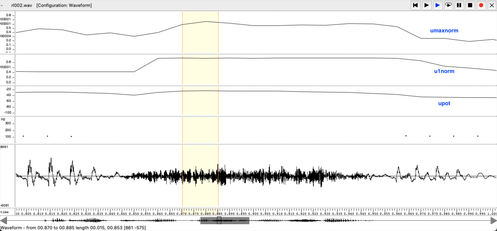
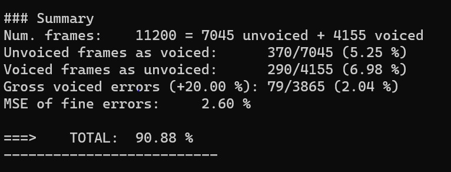

PAV - P3: estimación de pitch
=============================

Esta práctica se distribuye a través del repositorio GitHub [Práctica 3](https://github.com/albino-pav/P3).
Siga las instrucciones de la [Práctica 2](https://github.com/albino-pav/P2) para realizar un `fork` de la
misma y distribuir copias locales (*clones*) del mismo a los distintos integrantes del grupo de prácticas.

Recuerde realizar el *pull request* al repositorio original una vez completada la práctica.

Ejercicios básicos
------------------

- Complete el código de los ficheros necesarios para realizar la estimación de pitch usando el programa
  `get_pitch`.

   * Complete el cálculo de la autocorrelación e inserte a continuación el código correspondiente.
   
```
for (unsigned int l = 0; l < r.size(); ++l) {

      r[l]= 0.0f;
      for(unsigned int n = l; n<x.size();n++){
        r[l] += x[n]*x[n-l];
      }
      r[l] = r[l] / x.size();
      
    if (r[0] == 0.0F) //to avoid log() and divide zero 
      r[0] = 1e-10;  
    }
  };
```

   * Inserte una gŕafica donde, en un *subplot*, se vea con claridad la señal temporal de un segmento de
     unos 30 ms de un fonema sonoro y su periodo de pitch; y, en otro *subplot*, se vea con claridad la
	 autocorrelación de la señal y la posición del primer máximo secundario.

	 NOTA: es más que probable que tenga que usar Python, Octave/MATLAB u otro programa semejante para
	 hacerlo. Se valorará la utilización de la biblioteca matplotlib de Python.


   * Determine el mejor candidato para el periodo de pitch localizando el primer máximo secundario de la
     autocorrelación. Inserte a continuación el código correspondiente.
```
vector<float>::const_iterator iR = r.begin(), iRMax = iR;
    for (iR = iRMax = r.begin() + npitch_min; iR < r.begin() + npitch_max; iR++) {
      if (*iR > *iRMax) {
        iRMax = iR;
      }
    }
```

   * Implemente la regla de decisión sonoro o sordo e inserte el código correspondiente.
```
if ((pot < -upot || r1norm < u1norm) && rmaxnorm < umaxnorm) 
      return true;
    else
      return false;
```
Podemos detectar si se trata de sonoro o sordo segun los valores obtenidos en las gráficas adjuntas. Estos valores los hemos identificado con 
las variables upot, u1norm y umaxnorm, declaradas previamente. 

- Una vez completados los puntos anteriores, dispondrá de una primera versión del estimador de pitch. El 
  resto del trabajo consiste, básicamente, en obtener las mejores prestaciones posibles con él.

  * Utilice el programa `wavesurfer` para analizar las condiciones apropiadas para determinar si un
    segmento es sonoro o sordo. 
	
	- Inserte una gráfica con la estimación de pitch incorporada a `wavesurfer` y, junto a ella, los 
	  principales candidatos para determinar la sonoridad de la voz: el nivel de potencia de la señal
		(r[0]), la autocorrelación normalizada de uno (r1norm = r[1] / r[0]) y el valor de la
		autocorrelación en su máximo secundario (rmaxnorm = r[lag] / r[0]).

	Puede considerar, también, la conveniencia de usar la tasa de cruces por cero.

	Recuerde configurar los paneles de datos para que el desplazamiento de ventana sea el adecuado, que
	en esta práctica es de 15 ms.
		
	-> Para poder obtener de forma más precisa los valores de potencia, autocorrelación y atocorrelación normalizada, 
	representamos con el wavesurfer los tres ficheros de datos de nuestra señal de referencia (rl002.f0).
	  
	En un tramo sonoro con una ventana de 15 ms, hemos encontrado lo siguiente: 
	
<p align="center">
  
</p>
	En un tramo sordo con una ventana de 15 ms, hemos encontrado lo siguiente: 
	
<p align="center">
  
</p>
-> La primera gráfica que se observa es la de la autocorrelación normalizada (`autocorrelayion_norm.txt`), 
con variable urmaxnorm, la siguiente es la de la autocorrelacion (`autocorrelation.txt`), con variable u1norm, 
a continuación la potencia (`power.pot`), con variable upot, y al final el pitch estimation y la propia señal rl002.wav. 
Tal y como vemos en las gráficas, los tramos sonoros son delimitados por la variable umaxnorm, la 
cual tiene un valor inferior a 0.5, la u1norm de 0.8 por encima y la potencia upot por debajo de los -40 dB. 

- Use el estimador de pitch implementado en el programa `wavesurfer` en una señal de prueba y compare
su resultado con el obtenido por la mejor versión de su propio sistema.  Inserte una gráfica
ilustrativa del resultado de ambos estimadores.
Aunque puede usar el propio Wavesurfer para obtener la representación, se valorará
el uso de alternativas de mayor calidad (particularmente Python).

-> Usando el programa `wavesurfer` sacamos la comparación de los pitch generados por nuestro código y el generado 
por la propia señal. La señal de prueba que hemos usado es la rl002.wav. 

<p align="center">
  
</p>
	
  * Optimice los parámetros de su sistema de estimación de pitch e inserte una tabla con las tasas de error
    y el *score* TOTAL proporcionados por `pitch_evaluate` en la evaluación de la base de datos 
	`pitch_db/train`..

-> Usando el comando: ``pitch_db/train/*.f0ref ```:
Este resultado lo podemos obtener numericamente con el código de `pitch_evaluate` de la base de datos, ejecutando y consiguiendo lo siguiente: 

<p align="center">
  
</p>
	
Para el fichero de prueba (rl002.wav), obtenemos una mayor detección. 
	
<p align="center">
  
</p>

Ejercicios de ampliación
------------------------

- Usando la librería `docopt_cpp`, modifique el fichero `get_pitch.cpp` para incorporar los parámetros del
  estimador a los argumentos de la línea de comandos.
  
  Esta técnica le resultará especialmente útil para optimizar los parámetros del estimador. Recuerde que
  una parte importante de la evaluación recaerá en el resultado obtenido en la estimación de pitch en la
  base de datos.
  
  * Inserte un *pantallazo* en el que se vea el mensaje de ayuda del programa y un ejemplo de utilización
    con los argumentos añadidos.
    
<p align="center">
  
</p>

Para facilitar el uso del programa y la detección de pitch, hemos añadidio varias variables: umaxnorm (umbral del máximo de la autocorrelación normalizada), 
u1norm (umnbral de la autocorrelación normalizada en 1) y upot (umbral del nivel de potencia). Estas nos permiten una mayor facilidad en la 
aproximación de los parametros óptimos. 

Captura del mensaje de especificación de los argumentos.     
<p align="center">
  
</p>

- Implemente las técnicas que considere oportunas para optimizar las prestaciones del sistema de estimación
  de pitch.

  Entre las posibles mejoras, puede escoger una o más de las siguientes:

  * Técnicas de preprocesado: filtrado paso bajo, diezmado, *center clipping*, etc.

  -> Para el preprocesado hemos utilizado la técnica de CENTER-CLIPPING con el código siguiente: 
```
 float alpha = 0.0042;
  for (iX = x.begin(); iX  < x.end(); iX++ ) {
    if (*iX < alpha && *iX > -alpha){ 
      *iX = 0;
    }
  }
```
  Esta técnica consiste en anular los valores de magnitud pequeña de la señal, permitiendo que al introducir 
  una distorsión no lineal, la intensidad de los harmónicos de orden elevado aumenten. Generando una robustez 
  de los harmómicos frente al ruido. 

  * Técnicas de postprocesado: filtro de mediana, *dynamic time warping*, etc.

 -> En el postprocesado hemos usado la técnica del FILTRO DE MEDIANA con el código siguiente: 
  ```
 float aux = 0;
  int k_wind = 1; ///window size
  for(int i = 0; i < (int)f0.size(); i++){
    for(int j = 0; j < k_wind; ++j){
      if(i <= ((int)f0.size()-k_wind)){
        aux += f0[i + j]; 
      }else{
        aux = f0[i];
      }
    }
    f0[i] = aux/k_wind;
    aux=0;
  }
  ```
  Esta técnica consiste en un filtro no lineal para evitar la mala detección del pitch cogiendo sus múltiplos o  submultiplos de la freuencia real. 
  Se basa en caluclar el valor mediano en una ventana centrada en cada instante de tiempo, con la función de reducir el ruido. Su uso es más 
  concreto en señales con errores muy groseros, ya que podria incrementar el error fino de la estimación. 
  
  Para ello, nos hemos dado cuenta que al implementar este filtro, el porcentaje de detección disminuye, aumentando los errores gruesos (tal y como se ve
  en la captura adjunta).
  
<p align="center">
  
</p>
  
  Por este motivo, mantenemos el filtro de mediana con un tamaño de ventana de 1. 

  * Métodos alternativos a la autocorrelación: procesado cepstral, *average magnitude difference function*
    (AMDF), etc.
  * Optimización **demostrable** de los parámetros que gobiernan el estimador, en concreto, de los que
    gobiernan la decisión sonoro/sordo.
  * Cualquier otra técnica que se le pueda ocurrir o encuentre en la literatura.

  Encontrará más información acerca de estas técnicas en las [Transparencias del Curso](https://atenea.upc.edu/pluginfile.php/2908770/mod_resource/content/3/2b_PS%20Techniques.pdf)
  y en [Spoken Language Processing](https://discovery.upc.edu/iii/encore/record/C__Rb1233593?lang=cat).
  También encontrará más información en los anexos del enunciado de esta práctica.

  Incluya, a continuación, una explicación de las técnicas incorporadas al estimador. Se valorará la
  inclusión de gráficas, tablas, código o cualquier otra cosa que ayude a comprender el trabajo realizado.

  También se valorará la realización de un estudio de los parámetros involucrados. Por ejemplo, si se opta
  por implementar el filtro de mediana, se valorará el análisis de los resultados obtenidos en función de
  la longitud del filtro. 
   

Evaluación *ciega* del estimador
-------------------------------

Antes de realizar el *pull request* debe asegurarse de que su repositorio contiene los ficheros necesarios
para compilar los programas correctamente ejecutando `make release`.

Con los ejecutables construidos de esta manera, los profesores de la asignatura procederán a evaluar el
estimador con la parte de test de la base de datos (desconocida para los alumnos). Una parte importante de
la nota de la práctica recaerá en el resultado de esta evaluación.
